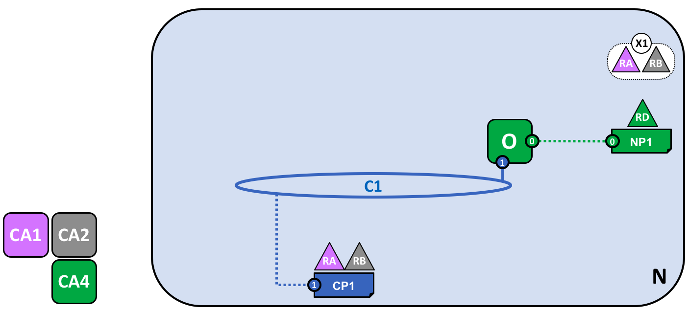
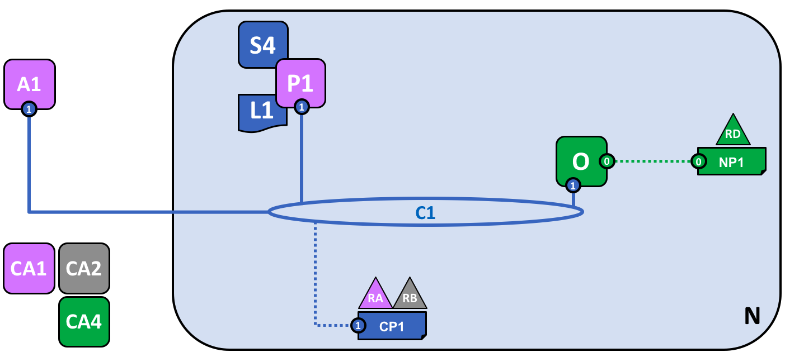

# Blockchain Network

A blockchain network is a technical infrastructure that provides smart contract
and ledger services to application consumers. Multiple organizations come
together to form the network, and their permissions are determined by a set of
policies that are agreed when the network is set up. Moreover, these policies
can change over time, subject to the agreement of the member organizations of
the network.

In this topic, we'll focus on the major components of the network, why they
exist, and when to use them.

## Network Structure

An overview section on

* What is a blockchain network?
* The key components of the network
* Why is the network structured this way?

## Creating the Network

* The ordering service is the anchor point for the network
* The Ordering Service as a network management point
* Ordering service policy

## Defining a Consortium

* What is a consortium?
* Why is a consortium important?
* Organizations and Membership

## Creating a channel for a consortium

* What is a channel?
* Why are channels useful?
* Channels and the ledger
* Channel Configuration and Policy

## Peers and Channels

* Creating a peer
* Joining a peer to a channel
* The ledger

## Application and Smart contracts

* Installing and instantiating smart contracts
* Connecting applications to peers via Channels
* Transactions

## Growing the network

## Simplifying the visual vocabulary

## Adding another consortium definition

## Adding a new channel

## Adding another peer

## Joining a peer to multiple channels

## Network fully formed

Simple vocabulary

Better arrangement

