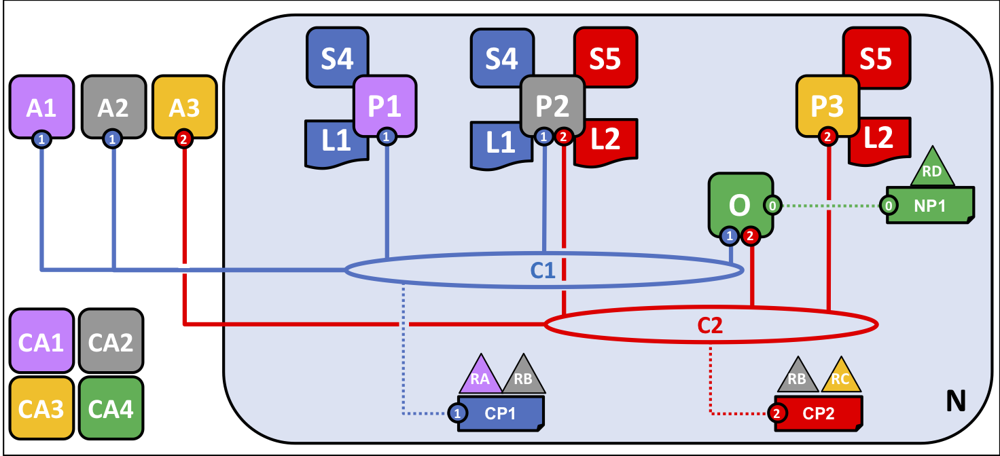
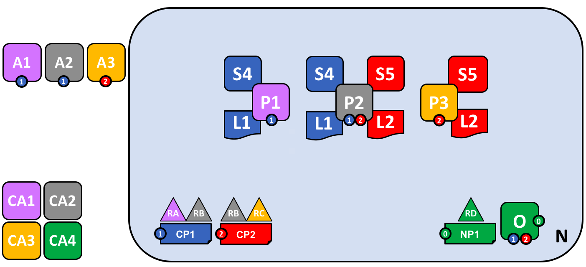

# Hyperledger Fabric blockchain networks

Hyperledger Fabric allows organizations to collaborate in the formation of
blockchain networks.  This topic will describe, **at a conceptual level**, how
these networks are structured. If you're an architect, administrator or
developer, you can use this topic to get a solid understanding of the major
components in a Hyperledger Fabric blocklchain network. It will use a simple
worked example that introduces all of the major components in a blockchain
network. You can then read more detailed information in the relevant topic.

## A blockchain network

A blockchain network is a technical infrastructure that provides ledger and
chaincode (smart contract) services to application consumers. The users of
those applications might be end users or administrators.

In most cases, multiple [organizations](../glossary.html#organization) come
together as a [consortium](../glossary.html#consortium) to form the network and
their permissions are determined by a set of [policies](../glossary.html#policy)
that are agreed by the the consortium when the network is originally
configured. Moreover, network policies can change over time subject to the
agreement of the organizations in the consortium.

## The sample network

Organizations R1, R2, R3 and R4 have decided to jointly invest in a Hyperledger
Fabric blockchain network.  They have decided that the network will be
administered by R4, who will be responsible for creating network policies that
allow R1, R2 and R3 to interact in a manner they deem appropriate. Specifically,
R4 will not transact in the network -- it only provides administrative
functionality to help R1, R2, R3 achieve their collective goals. Many other
configurations are possible but this simple configuration is an excellent start
to provide a solid conceptual understanding.

Before we start, let's show you what we're aiming at! Here's the **final state**
of the network.

*Caption*

Don't worry that this might look complicated! As we go through this topic, we
will build up the network piece by piece, so that you see how R1, R2, R3 and R4
contribute infrastructure to the network to help form it, and agree policies
which determine how that infrastructure behaves.  Most importantly, you'll
discover how applications consume the ledger and chaincode services provided by
the organizations that form the network.

## Creating the Network

Let's start at the beginning by creating the network.

*Caption*

We can see that the first thing that defines a network is O1, an **ordering
service**. It's helpful to think of the ordering service as the initial
administration point for the network. As agreed by R1-R4, O1 is initially
configured and started by an administrator in organization R4, and hosted in R4.
The configuration NC1 contains the policies that govern the administrative
capabilities available to R1, R2, R3 and R4, and initially this is set to give
R4 rights over the network. This will change, as we'll see later.

In its simplest form, the ordering service is a single node in the network, and
that's waht you can see in the example. Ordering services are usually
multi-node, and can be configured to have different nodes in different
organizations. Indeed, the ordering service nodes are in fact a mini-blockchain,
whose ledger contains the history of updates to the network configuration,
starting with this first configuration, the so called genesis block. This is
interesting detail, but for now just think of the ordering service as an
administration point.

We can also see a certificate authority, CA4. Certificate authorities play a key
role in Hyperledger Fabric, because they dispense identity information that
identifies users and network components as belonging to a particular
organization. The network configuration NC1 uses these identities to grant
different rights over network resources to different organizations, using an
MSP.  We don't show MSPs on these diagrams, as they would just clutter them up,
but they are important.

Why does the network have this basic structure?  Well, it has all the minimal
set of components. There's a set of users -- as defined by a CA, a resource --
the network, and a set of rights those users have over the network.  And all
this is made real by the ordering service -- in our case a single node running
as an operating system process.

## Defining a Consortium

Although the network has been started by R4, the network as it stands has very
few possibilities. The first thing we need to do is define a consortium. This
word literally means "a group with a shared destiny", so it's an appropriate
choice for a set of organizations in a blockchain network.

*Caption*

NC1 is initially configured to only allow R4 create new consortia. This diagram
shows the addition of a new consortium, X1, which defines two organizations R1
and R2 as its members.  We can also see that two CAs -- CA1 and CA2 -- are used
to identify users from these organizations.  R4 can now update the policy
definition in NC1 to allow R1 and R2 to create new consortia too.   In this way,
even though R4 is running the ordering service, R1, R2 and R4 have shared
administrative rights over who can define new consortia.

Why are consortia important? We can see that a consortium defines two or more
organizations on the network who share a need to transact with one another -- in
this case R1 and R2. It really makes sense to group organizations together if
they have a common goal, and that's exactly what's happening in this instance.

The network, although started by a single organization is now controlled by a
much larger set of organizations.  We could have started it this way, with R1,
R2 and R4 having shared control, but this build up makes it easier to
understand.

We're now going to use X1 to create a really important part of a Hyperledger Fabric blockchain -- **a channel**.

## Creating a channel for a consortium

So let's create this key part of the blockchain network -- **a channel**. A
channel is a primary communications mechanism by which the members of a
consortia can communicate with each other. There can be multiple channels in a
network, but for now, we'll start with one.

*Caption*

In the previous step, we saw how R4 could grant R1, R2 the permission to create
new consortia. It's helpful to mention that R4 **also** allowed R1 and R2 to
create channels! So in this diagram, we've seen how organization R1 created a
channel C1, for consortia X1. That's what we can see in the network -- a private
communications mechanism for the consortia X1 that is quite separate to the
network N.  Organizations R3 and R4 are not in this channel -- it is for
transaction processing between R1 and R2.

Moreover, C1 has a completely separate configuration, CC1, to the network
configuration NC1. CC1 contains the policies that govern the permissions that R1
and R2 have over the channel C1 -- and as we've seen, R3 and R4 have no
permissions in this channel.

Why are channels so important? We can see that once a channel has been created,
it is in a very real sense "free from the network". It is only organizations
that are explicitly specified a channel configuration that have any control over
it, from this time forward into the future. Channels are therefore are useful
because they allow for data isolation and privacy of communications.

We can see that channel C1 is initially created at the ordering service O1, but
has nothing attached to it. We're going to connect the ordering service to other
components soon, but at this point, a channel represents a **potential** for
connectivity.  We're going to connect client applications and other network
components together on a channel, but for now, none of this has been done.

## Peers and Ledgers

Let's now start to use the channel to connect blockchain components together.
We can see that our network N has just acquired two new components, namely a
peer node P1 and a ledger instance, L1.

*Caption*

Peer nodes are the network components where copies of the blockchain ledger are
hosted!  At last, we're starting to see some recognizable blockchain components!

An administrator in R1 has configured the peer node P1 and started it. A key
part of a peer's configuration is an identity issued by CA1 which associates P1
with organization R1. After P1 is started for the first time, an administrator
can ask P1 to **join** channel C1 on the order O1. When the orderer receives
this request, it uses the channel configuration CC1 to identify P1's
organization -- R1 -- which determines the peer's permissions on this channel.
From this stage, we can say that P1 is joined to channel C1.

P1's purpose in the network is purely to host a copy of the ledger L1 for others
to access. We can think of L1 as being **physically hosted** on P1, but
**logically hosted** on the channel C1. We'll see this idea more clearly when we
add more peers to the channel.

We can see organization R1 has added a resource to the network in the form of
peer node P1. The initial network was formed from resources from R4 -- an
ordering service -- and has now been extended by organization R1, albeit it in a
private channel.

## Applications and Smart Contracts

Now that the channel C1 has a ledger on it, we can start connecting
applications to consume some of the services provided by the ledger!

*Caption*

In the next stage of network development, we can see that A1 has used channel C1
to connect to the network -- in this case A1 can connect to both peer node P1
and orderer O1. Again, see how channels are central to the communication between
network components. Just like peers and orderers, an application will have an
identity that associates it with an organization.  In our example A1 is
associated with R1.

It might now appear that A1 can access the ledger L1 directly via P1, but in
fact, all access is managed via a special program called a smart contract
chaincode, S4. Think of S4 as defining all the common access patterns to the
ledger, so that there is a well-defined set of ways by which the ledger L1 can
be queried or updated. A1 has to access S4 to perform any operation on the
ledger L1.

Chaincodes are created by application developers to implement a business process
shared by the consortium members. Chaincodes take a transaction proposal from an
application and operate on a ledger to generate a transaction response. But
before a chaincode can be accessed by an application, it must be
[installed](../glossary.html#install) on a peer.  In our example, S4 has been
installed on P1 by an administrator in R1.

After the chaincode S4 has been installed a peers, it can then be
[instantiated](../glossary.html#instantiate) on the channel C1, before it can be
[invoked](../glossary.html#invoke) by A1. The act of instantiating a chaincode
makes it known to all network components that are connected to the channel. The
most important piece of information that is supplied at chaincode instantiation
is its endorsement policy which describes which organization must approve
transaction proposals generated by this chaincode before they will be accepted
onto the ledger.

Note that an organization must have the chaincode must be installed by all the
organizations who require  @@

Now that there is an installed an instantiated chaincode, it can be used by an
application to generate valid transactions, and have them accepted onto the
ledger.  This is a two step process which involves applications first getting
transaction endorsements from the installed chaincodes, and then distributing
these transactions to all the peers in the network who can check that the
transactions have been endorsed by the appropriate organizations before adding
them to their copy of the ledger.

without divulging its contents - that is all components of the channel know
there is a chaincode S4, but they do not know the program logic contained with
it.

Why is the act of installing a chaincode so important? Well, it's only
organzations that have installed a chaincode who can endorse the transactions
that it generates. This is an important aspect that is examined in more detail
in the [transaction flow topic](..). For now, think of instantiation as a final
step before a chaincode is considered **live** in the channel.

By this stage in network development we can see that organization R1 is fully
participating in the network.

## Growing the network

However, let's recall that channel C1 was created for consortium X1, so the next
stage of network development sees R2 add a similar set of network components to
R1.

*Caption*

Specifically, R2 adds a peer P2 on channel C1 which hostsa copy of the ledger L1
and smart contract S4.  R2 does not need to instantiate S4 on C1 because
everyone on C1 already knows about S4.  At this stage of network development R2
is merely adding another instance of of L1 and S4 to the network.  Again, see
how the ledger L1 really does exist in a physical manner on the peers, and a
logical manner on the channel.

At this stage in network development, we have created a channel in which both
member organizations, R1 and R2, of consortium X1, can fully participate.

Specifically, this means that applications A1 and A2 can generate properly
endorsed transactions which can be accepted by peers onto their copy of the
ledger. Applications created well formed transactions by asking the endorsing
peers repsonsible for @@

using the smart contract S4 hosted on the peers P1 and P2,
and subequently distribute them to all ledgers in the network using the ordering
service.  In our example, that's the same set of peers, but in general a network
contains many more peers without chaincode than peers with chaincode.

While there no theoretical limit to how big a network can get, as the network
grows it is important to consider design choices that will help optimize network
throughput, stability, and resilience.  Evaluations of network policies and
implementation of [gossip protocol](../gossip.html#gossip-protocol) to
accommodate a large number of peer nodes are potential considerations.

## Simplifying the visual vocabulary

*In the diagram below we see that there are two client applications connected to two peer nodes and an ordering service on one channel.  Since there is only one channel, there is only one logical ledger in this example.  As in the case of this single channel, P1 and P2 will have identical copies of the ledger (L1) and smart contract -- aka chaincode (S4).*

## Adding another consortium definition

As consortia are defined and added to the existing channel, we must update the channel configuration by sending a channel configuration update transaction to the ordering service. If the transaction is valid, the ordering service will generate a new configuration block.  Peers on the network will then have to validate the new channel configuration block generated by the ordering service and update their channel configurations if they validate the new block.  It is important to note that the channel configuration update transaction is handled by [*system chaincode*](../glossary.html#system-chain) as invoked by the Blockchain network Administrator, and is not invoked by client application transaction proposals.

## Adding a new channel

Organizations are what form and join channels, and channel configurations can be amended to add organizations as the network grows. When adding a new channel to the network, channel policies remain separate from other channels configured on the same network.

*In this example, the configurations for channel 1 and channel 2 on the ordering service will remain separate from one another.*

## Adding another peer

*In this example, peer 3 (P3) owned by organization 3 has been added to channel 2 (C2).  Note that although there can be multiple ordering services on the network, there can also be a single ordering service that governs multiple channels.  In this example, the channel policies of C2 are isolated from those of C1.  Peer 3 (P3) is also isolated from C1 as it is authenticated only to C2.*

## Joining a peer to multiple channels

*In this example, peer 2 (P2) has been joined to channel 2 (C2).  P2 will keep channels C1 and C2 and their associated transactions private and isolated.  Additionally, client application A3 will also be isolated from C1.  The ordering service maintains network governance and channel isolation by evaluating policies and digital signatures of all nodes configured on all channels.*

## Network fully formed

*In this example, the network has been developed to include multiple client applications, peers, and channels connected to a single ordering service. Peer 2 (P2) is the only peer node connected to channels C1 and C2, which will be kept isolated from each other and their data will remain private.  There are now two logical ledgers in this example, one for C1, and one for C2.*

Simple vocabulary

Better arrangement

-------------------

Organization R1 will contribute 3 peers, and 2 client
applications of R1 will consume the services of the blockchain network.
Organization R2 will contribute 4 peers and has 1 client application.
Organization R3 contributes 3 peers and has 2 client applications. Organization
R4 contributes 4 orderers. Organization R1 and R2 have decided to form a
consortium and exploit a separate application channel between the two of them.
Organizations R2 and R3 have decided to form another consortium and also exploit
a separate application channel between the two of them. Each application channel
has its own policy.

## Components of a Network

A network consists of:

* [Ledgers](../glossary.html#ledger) (one per channel -- comprised of the [blockchain](../glossary.html#block) and the [state database](../glossary.html#state-database))
* [Smart contract(s)](../glossary.html#smart-contract) (aka chaincode)
* [Peer](../glossary.html#peer) nodes
* [Ordering service(s)](../glossary.html#ordering-service)
* [Channel(s)](../glossary.html#channel)
* [Fabric Certificate Authorities](../glossary.html#hyperledger-fabric-ca)

### Consumers of Network Services

* Client applications owned by organizations
* Clients of Blockchain network administrators

### Network Policies and Identities

The Fabric Certificate Authority (CA) issues the certificates for organizations to authenticate to the network.  There can be one or more CAs on the network and organizations can choose to use their own CA.  Additionally, client applications owned by organizations in the consortium use certificates to authenticate [transaction](../glossary.html#transaction) [proposals](../glossary.html#proposal), and peers use them to endorse proposals and commit transactions to the ledger if they are valid.

*The explanation of the diagram is as follows:
There is a Fabric network N with network policy NP1 and ordering service O. Channel C1 is governed by channel policy CP1.  Channel C1 has been established by consortium RARB. Channel C1 is managed by ordering service O and peers P1 and P2 and client applications A1 and A2 have been granted permission to transact on C1. Client application A1 is owned by organization RA. Certificate authority CA1 serves organization RA. Peer P2 maintains ledger L1 associated with channel C1 and L2 associated with C2. Peer P2 makes use of chain code S4 and S5. The orderer nodes of ordering service O are owned by organization RD.*

This topic document will take you through the decisions that organizations will
need to make to configure and deploy a Hyperledger Fabric network, form channels
to transact within the network, and how to update those decisions within the
life of the network. You will also learn how those decisions are embedded in the
architecture and components of Hyperledger Fabric.

which has a policy associated with it that determines the rights of differet

The network is created from the definition of the consortium including its clients, peers, channels, and ordering service(s).  The ordering service is the administration point for the network because it contains the configuration for the channel(s) within the network.  The configurations for each channel includes the policies for the channel and the [membership](../glossary.html#membership-services) information (in this example X509 root certificates) for each member of the channel.

Internally, created channels are recorded in a configuration block on the
ordering service, which evaluates the validity of the channel configuration.
Channels are useful because they allow for data isolation and confidentiality.
Transacting organizations must be authenticated to a channel in order to
interact with it. Channels are governed by the policies they are configured
with.

topic [peers] Peers are joined to channels by the organizations that own them, and there can be multiple peer nodes on channels within the network.  Peers can take on multiple roles:

* [*Endorsing peer*](../glossary.html#endorsement) -- defined by policy as specific nodes that execute smart contract transactions in simulation and return a proposal response (endorsement) to the client application.
* [*Committing peer*](../glossary.html#commitment) -- validates blocks of ordered transactions and commits (writes/appends) the blocks to a copy of the ledger it maintains.

Because all peers maintain a copy of the ledger for every channel to which they are joined, all peers are committing peers.  However, only peers specified by the endorsement policy of the smart contract can be endorsing peers.  A peer may be further defined by the roles below:

* [*Anchor peer*](../glossary.html#anchor-peer) -- defined in the channel configuration and is the first peer that will be discovered on the network by other organizations within a channel they are joined to.
* [*Leading peer*](../glossary.html#leading-peer) -- exists on the network to communicate with the ordering service on behalf of an organization that has multiple peers.

Smart contract chaincode must be  on a
peer, and organizations can choose which

and [instantiated](../glossary.html#instantiate) on a peer in order for a client application to be able to [invoke](../glossary.html#invoke) the smart contract.  Client applications are the only place outside the network where transaction proposals are generated.  When a transaction is proposed by a client application, the smart contract is invoked on the endorsing peers who simulate the execution of the smart contract against their copy of the ledger and send the proposal response (endorsement) back to the client application.  The client application assembles these responses into a transaction and broadcasts it to the ordering service.
