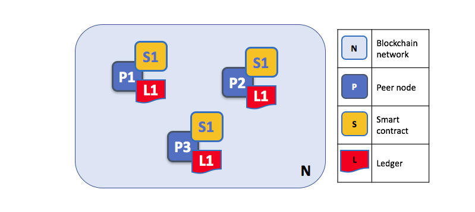
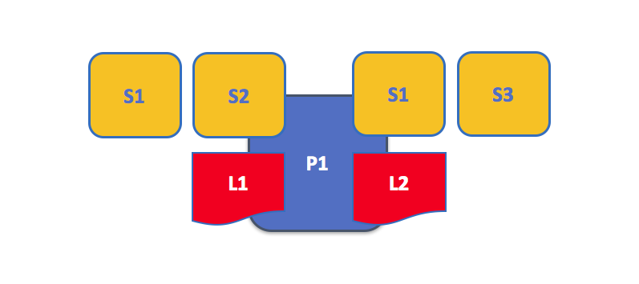
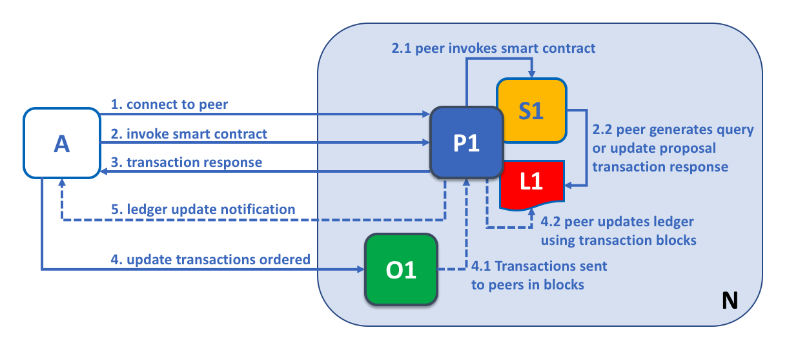
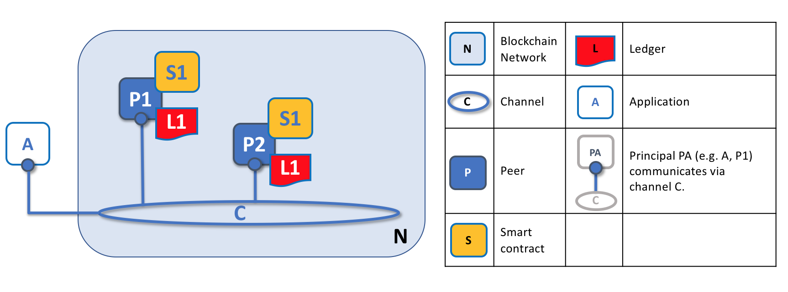
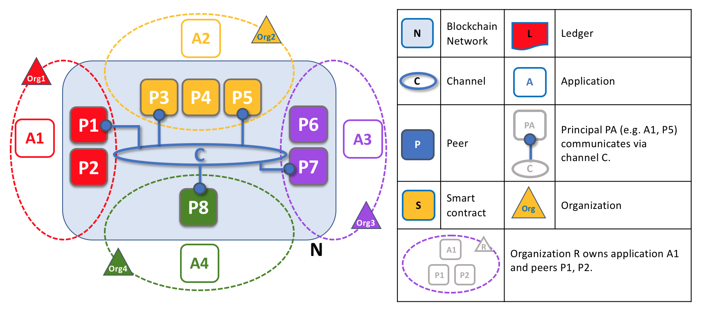
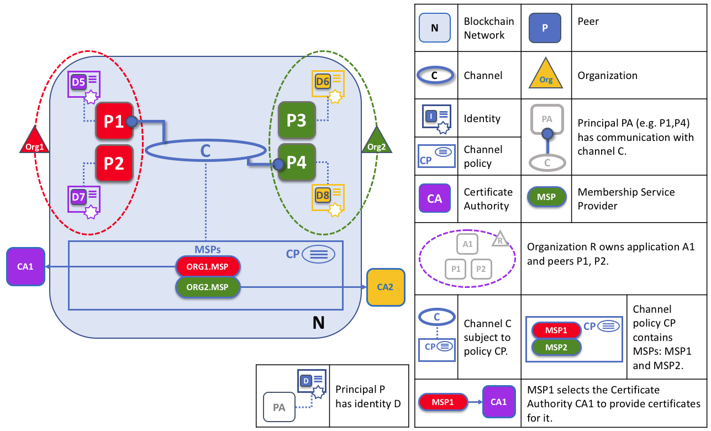
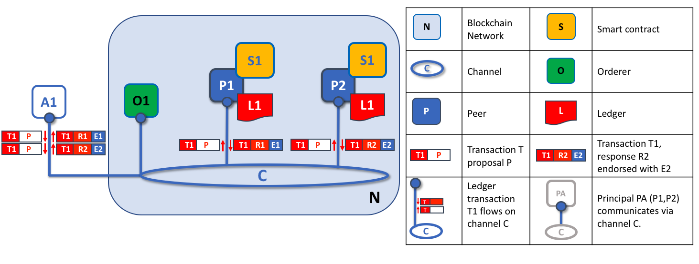
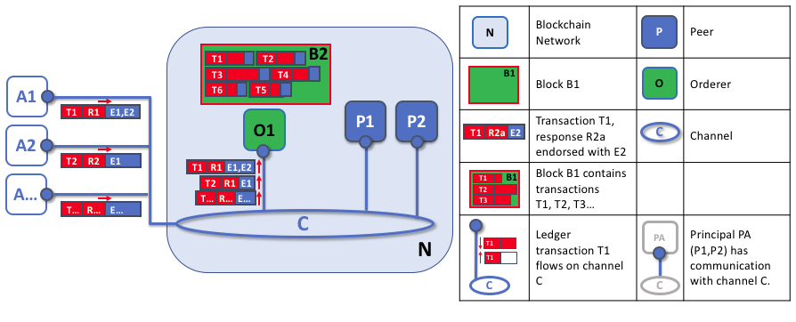
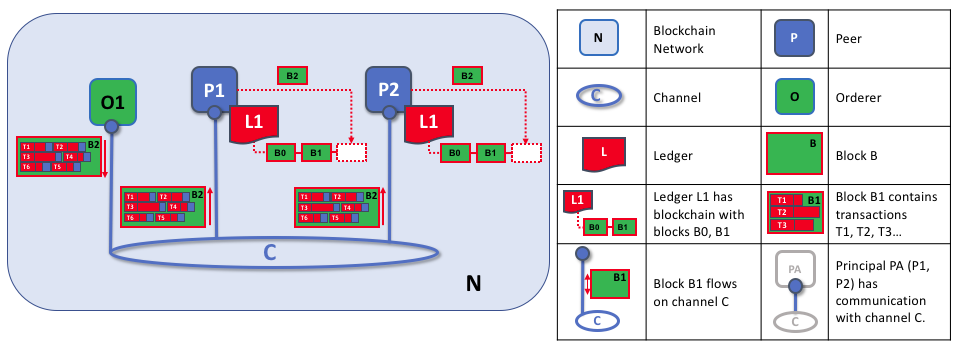

# Peers

A blockchain network is primarily formed by a set of peer nodes. Peers are the
most important elements of the network because they host ledgers and smart
contracts (which in Hyperledger Fabric are implemented through chaincodes).
Recall that a ledger is like a database -- it's where the records of
transactions and  other ledger updates are stored -- and a smart contract is
like a program to access that store. Smart contracts and ledgers are used to
encapsulate the shared *processes* and shared *information* in a network,
respectively.

Without peers, there cannot be a blockchain network, and they are the first
concept to that needs to be understood. Other elements of the network are
important -- such as orderers, policies, and channels -- and we'll talk about
some of these later (channels in particular).

*A blockchain network is formed from peer nodes, each of which can hold copies
of a ledger and copies of a smart contract. In this example, the network N is
formed by peers P1, P2 and P3. P1, P2 and P3 each maintain their own instance
of the ledger L1. P1, P2 and P3 use smart contract S1 to access their copy of
the ledger L1.*

*Peers are the primary objects that administrators manage on a day-to-day basis
using the `peer` command*. Peers can be created, started, stopped,
reconfigured, and even deleted. Peers appear as operating system processes,
which, when connected to, provide a range of services to administrators and
programmers. We'll learn more about these services in this topic.

It's helpful to remember that the blockchain network only comes into existence
when peers and certain other objects -- ledgers, smart contracts, policies,
orderers, and MSPs -- are defined. This means that *a blockchain network is not
a separable object*. The administration of a blockchain network amounts to the
management of its constituent parts, rather than any separate object called a
"network". It is therefore best to think of it as being *co-administrated*.

## Smart Contracts and Ledgers

Let's look at a peer in a little more detail. We can see that it's the peer that
hosts both the ledger and smart contracts. More accurately, the peer actually
hosts *instances* of the ledger, and *instances* of smart contract chaincode.
Note that this provides a deliberate redundancy in a Fabric network  -- it
avoids single points of failure. We'll learn more about the distributed  and
decentralized nature of a blockchain network later in this topic.

*A peer hosts instances of ledgers and instances of smart contracts. In this
example, P1 hosts an instance of ledger L1 and an instance of smart contract
S1. There can be many ledgers and smart contracts hosted on an individual
peer.*

When a peer is first created, has neither ledgers nor smart contracts. We'll
see later how ledgers exist within the context of the channel (or channels) a
peer is joined to. And we'll see how it's necessary for a peer to install and
instantiate a smart contract before it can generate ledger transactions to
distribute throughout the blockchain network.

Because a peer is a *host* for smart contracts and ledgers, if a network
participant (e.g. an application outside the network) wants to provide or
consume smart contracts and ledgers, they must interact with a peer. A network
participant might be using an application, or might be an administrator -- but
it's always the peer that provides the services that allow applications to
interact with ledgers and smart contracts. That's why peers are considered the
most fundamental building blocks of a Hyperledger Fabric blockchain network.

### Multiple Ledgers

A peer is able to host more than one ledger, which is helpful because it allows
for a very flexible system design. The simplest peer configuration is to have a
single ledger, but it's absolutely appropriate for a peer to host two or more
ledgers when required. We'll see later how peers interact with the ledger, but
for now, it's easiest to think of the ledger as being hosted on the peer.

*A peer hosting multiple ledgers. Peers host one or more ledgers, and each
ledger has zero or more smart contracts that apply to them. In this example, we
can see that the peer P1 hosts ledgers L1 and L2. Ledger L1 is accessed using
smart contract S1. Ledger L2 on the other hand can be accessed using smart
contracts S1 and S2.*

Although its perfectly possible for a peer to host a ledger instance without
hosting any smart contracts which access it, it's very rare that peers are
configured this way. The vast majority of peers will have at least one smart
contract installed on it which can query or update the peer's ledger instances.

### Multiple Smart Contracts

There is no necessary relationship between the number of ledgers a peer has and
the number of smart contracts installed on it. A peer might be on a channel that
uses multiple smart contracts (one ledger, in other words, and multiple smart
contracts), as in this example:

*An example of a peer hosting multiple smart contracts. Each ledger can have
many smart contracts which access it. In this example, we can see that peer P1
hosts ledgers L1 and L2. L1 is accessed by smart contracts S1 and S2, whereas
L2 is accessed by S3 and S1. We can see that S1 can access both L1 and L2.*

Likewise a peer might be a member of multiple channels that all use the  same
smart contract (if an insurance company wants to be able to offer the same
services to organizations on different channels, for example).

## Applications and Peers

Applications connect to network peers when they need to access ledgers and smart
contracts. A Software Development Kit (SDK) makes this easy for programs -- its
APIs (application program interfaces) make it possible to connect with ledgers,
invoke smart contracts, and receive ledger notifications.

Through a peer connection, applications can execute smart contracts to query or
update the ledger. Ledger queries are returned immediately, whereas ledger
updates are asynchronous -- they require the consensus process to complete
before the application can be informed.

Here is a simplified version of a transaction flow. Though it omits certain
steps that take place in an actual transaction, if you're still getting
acquainted with Fabric it will give you a sense of the basic flow.

For a more in depth look at this process, checkout our [Transaction
Flow](./source/txflow.rst) doc.

*The peer is the access point to the network for an application. In this
example, application A is connected to peer P1. Peer P1 hosts smart contract
S1 which accesses ledger L1. Smart contract S1 can query or update ledger
instance L1. When L1 is updated, peer P1 can notify application A.*

A query transaction can return its results immediately to the application
because all the information required to satisfy the query is in the local copy
of the ledger. Indeed, an application can connect to one or more peers in the
network which hosts a copy of the ledger to issue a query, as each peer's copy
of the ledger is kept up-to-date; though typically applications will connect to
a single peer (one reason why an application might query multiple peers is to
corroborate the result of its query to make sure a peer's ledger has not been
corrupted). Unlike the flow of a ledger update, which is achieved by consensus,
a peer does not need to consult with other peers in order to return a query.

An update transaction has a few things in common with a query -- applications
connect to peers, invoke a smart contract, receive asynchronous notifications as
the transaction progresses and when the ledger is updated. We'll see later that
what happens *under the covers* is significantly more complex for an update
transaction compared to a query, but that's not important from the
application's perspective.

## Peers and Channels

Although this topic is about peers rather than channels, it's worth spending a
little time understanding how peers interact with each other -- and applications  --
via *channels*, the mechanism by which a set of components within a blockchain
network can communicate and transact *privately*.

These components are typically peer nodes, orderer nodes, and applications, and
by joining a channel they agree to come together to collectively share and
manage identical copies of the ledger for that channel. Conceptually you can
think of channels as being similar to groups of friends (though the members of
a channel certainly don't need to be friends!). A person might have several
groups of friends, with each group having activities they do together. These
groups might be totally separate (a group of work friends as compared a group
of hobby friends), or there can be crossover between them. Nevertheless each
group is its own entity, with "rules" of a kind.

*Channels allow a specific set of peers and applications to communicate with
each other within a blockchain network. In this example, P1 and P2 have a
communication connection with channel C. Client application A also has a
communication connection with channel C (through the peers -- for simplicity
this diagram shows a direct connection to the channel, but applications
actually connect to a peer that has a connection to a channel). In this way,
channel C provides two-way communications between client application A and
peers P1 and P2. (For simplicity, orderers are not shown in this diagram, but
must be present in a functioning network.)*

We see that channels don't exist in the same way that peers do -- it's more
appropriate to think of a channel as a logical structure that is formed by a
collection of physical peers. *It is vital to understand this point -- peers
provide the control point for access to, and management of, channels*.

## Peers and Organizations

Now that you understand peers and their relationship to ledgers, smart contracts
and channels, you'll be able to see how multiple organizations come together to
form a blockchain network.

Blockchain networks are administered by a collection of organizations known as
a Consortium. Peers are central to how a this kind of distributed network is
built because they are owned by -- and are the connection points to the  network
for -- these organizations.

*Peers in a blockchain network with multiple organizations. The blockchain
network is built up from the peers owned and contributed by the different
organizations. In this example, we see four organizations contributing eight
peers to form a network. The channel C connects five of these peers in the
network N -- P1, P3, P5, P7 and P8. The other peers owned by these
organizations have not been joined to this channel, but are typically joined
to at least one other channel. Applications that have been developed by a
particular organization usually -- but not always -- connect to the peers owned
by that organization. Again, for simplicity, an orderer node is not shown in this
diagram.*

It's really important that you can see what's happening in the formation of a
blockchain network. *The network is both formed and managed by the multiple
organizations who contribute resources to it.* Peers are the resources that
we're discussing in this topic, but the resources an organization provides are
more than just peers. There's a principle at work here -- the network literally
does not exist without organizations contributing their individual resources to
the collective network. Moreover, the network grows and shrinks with the
resources that are provided by these collaborating organizations.

You can see that (other than the orderering service) there are no centralized
resources -- in the [example above](#Peer8), the network, **N**, would not exist
if the organizations did not contribute their peers. This reflects the fact that
the network does not exist in any meaningful sense unless and until
organizations contribute the resources that form it. Moreover, the network does
not depend on any individual organization -- it will continue to exist as long
as one organization remains*, no matter which other organizations may come and
go. This is at the heart of what it means for a network to be decentralized.

Applications in different organizations, as in the [example above](#Peer8), may
or may not be the same. That's because it's entirely up to an organization how
its applications process their peers' copies of the ledger. This means that both
application and presentation logic may vary from organization to organization
even though their respective peers host exactly the same ledger data.

Moreover, we can see that applications in a given organization access the
blockchain network via the peers that the organization provides to the
blockchain network. While it's possible for one organization's application to
connect to a peer in a different organization, it's not typical, and is
somewhat against the spirit of a de-centralized network.

## Peers and identity

Now that you've seen how peers from different organizations come together to
form a blockchain network, it's worth spending a few moments understanding how
peers get assigned to organizations by their administrators.

Peers have an identity assigned to them via a digital certificate from a
particular certificate authority. You can read lots more about how X.509
digital certificates  work elsewhere in this guide, but for now think of a
digital certificate as being  like an ID card that provides lots of verifiable
information about a peer. *Each and every peer in the network is assigned a
digital certificate by an administrator from its owning organization*.

*When a peer connects to a channel, its digital certificate identifies its
owning  organization via a channel MSP. In this example, P1 and P2 have
identities issued by CA1. Channel C determines from its policy that identities
from CA1 should be associated with Org1 using ORG1.MSP. Similarly, P3 and P4
are identified by ORG2.MSP as being part of Org2.*

Whenever a peer connects to a channel in a blockchain network, *its identity is
checked against the channel policy to determine its rights as dictated by the
organization to which it belongs*. The mapping of identity to organization is
provided by a component called a *Membership Service Provider* (MSP) -- it
determines how a peer gets assigned to a specific role in a particular
organization and accordingly gains appropriate access to blockchain resources.
Moreover, a peer can only be owned by a single organization, and is therefore
associated with a single MSP. We'll learn more about peer access control later
in this topic, and there's a entire topic on MSPs and access control policies
elsewhere in this guide.  But for now, think of an MSP as providing linkage
between an individual identity and a particular organizational role in a
blockchain network.

And to digress for a moment, peers as well as *everything that interacts with a
blockchain network acquire their organizational identity from their digital
certificate and an MSP*. Peers, applications, end users, administrators,
orderers  must have a identity and an associated MSP if they want to interact
with a blockchain network. *We give a name to every entity that interacts with
a blockchain network using an identity -- a principal.*  You can learn lots
more about principals and organizations elsewhere in this guide, but for now
you know more than enough to continue your understanding of peers!

Finally, note that it's not really important where the peer is physically
located -- it could be resident in the cloud, or in a data centre owned by one
of the organizations, or on a local machine -- it's the identity associated
with it that identifies it as owned by a particular organization. In our
example above, P3 could be hosted in Org1's data centre, but as long as the
digital certificate associated  with it is issued by CA2, then it's owned by
Org2.

## Peers and orderers

We've seen that peers form a blockchain network, hosting ledgers and smart
contracts which can be queried and updated by peer-connected applications.
However, the mechanism by which applications and peers interact with each other
to ensure that every peer's ledger is kept consistent is mediated by special
nodes called *orderers*, and it's these nodes to which we now turn our
attention.

An update transaction is quite different to a query transaction because a single
peer cannot, on its own, update the ledger -- it requires the consent of other
peers in the network. A peer requires other peers in the network to approve a
ledger update before it can be applied to a peer's local ledger. This process is
called *consensus* -- it is asynchronous in nature and therefore takes longer to
complete than a query. But when all the peers required to approve the
transaction do so, and the transaction is committed to the ledger, peers will
notify their connected applications that the ledger has been updated. You're
about to be shown a lot more detail about how peers and orderers manage the
consensus process in this section.

Specifically, applications that want to update the ledger are involved in a
3-phase  process, which ensures that all the peers in a blockchain network keep
their ledgers consistent with each other. In the first phase, applications work
with a subset of *endorsing peers*, each of which give their individual stamp
of approval to a proposed ledger update, but do not apply the proposed update
to their copy of the ledger. In the second phase, these separately endorsed
transaction updates are collected together into blocks so that they can be
checked for consistency. In the final phase, these blocks are distributed back
to every peer where each transaction proposal is validated before being applied
to that peer's copy of the ledger.

As you will see, orderer nodes are central to this process -- so let's
investigate in a little more detail how applications and peers use orderers to
generate ledger updates that can be consistently applied to a distributed,
replicated ledger.

### Transaction Phase 1: Proposal

The first phase of the transaction workflow does not involve an orderer node.
Applications generate a transaction proposal which they send to each of the
required set of peers for endorsement. Each peer then independently executes
that transaction proposal in a smart contract to generate a single transaction
response which they return to the application. Once the application has
received a sufficient number of endorsed transaction responses, the first phase
of the transaction flow is complete. Let's examine this phase in a little more
detail.

*Applications generate transaction proposals. These are independently executed
by peers and returned to the application as endorsed transaction responses. In
this example, application A1 generates transaction T1 proposal P which it
sends to both peer P1 and peer P2 on channel C. P1 executes S1 using
transaction T1 proposal P generating transaction T1 response R1 which it
endorses with E1 Independently, P2 executes S1 using transaction T1 proposal
P generating transaction T1 response R2 which it endorses with E2. Application
A1 receives two responses for transaction T1, namely R1 and R2.*

Initially, a set of peers are chosen by the application to generate a set of
proposed ledger updates. Which peers are chosen by the application? Well, that
depends on the *endorsement policy* (defined in a smart contract), which define
the set of organizations that need to be happy with a proposed ledger change
before it can be accepted by the network. This is literally what it means to
achieve consensus -- everyone who matters in the network must be happy with the
proposed ledger change *before* it can be applied.

At the peer level, this means that peers must wait until the consensus process
is complete before any change will be applied to its ledger. It's important to
remember that even though the **adminstration** of peers happens independently,
they cannot apply any changes to their ledgers until those changes have made it
through the endorsement/validation process (which itself is subject to an
endorsement process).

We'll see in phase 3 how all the transaction proposal responses from different
peers are gathered together for validation -- in such a way as to make sure they
would provide an agreed and consistent ledger update -- and how the orderer is
central to this process. But for now, let's note that phase 1 is only concerned
with an application asking different organizations' endorsing peers to agree
that each would be satisfied -- in principle -- to apply a particular
transaction update to the ledger.

Returning to the process of endorsement for a moment, each peer that generates a
transaction response signs the transaction response with its private key in a
process called *endorsement*. Endorsement of a transaction response by a peer is
a signal the organization that owns the peer is happy to see this transaction
applied to the ledger in the future, even though it is not applied at this time.
In our example, if peer P1 is owned by organization Org1, endorsement E1
corresponds to Org1 saying "I'm happy for this transaction T1 response R1 to be
applied to the ledger L1 -- here's my stamp of approval E1!".

Phase 1 ends when the application receives endorsed transaction responses from
sufficient peers to which it sent transaction proposals. We note that different
peers can return different and therefore inconsistent transaction responses to
the application *for the same transaction proposal*. That's because the
transaction result can be different when it is executed on different peers --
the term used to describe this kind of failure is *non-determinism*.
Non-determinism is the enemy of smart contracts and ledgers and if it
occurs it indicates a serious problem with the proposed transaction --
inconsistent results cannot, obviously, be applied to ledgers. Of course,
individual peers cannot know that their transaction result is
non-deterministic -- it requires transaction responses to be gathered together
for comparison before non-determinism can be detected. (Strictly speaking, even
this is not enough, but we defer this discussion to the transaction topic,
where non-determinism is discussed in detail.)

At the end of phase 1, the application is free to discard inconsistent
transaction  responses if it wishes to do so, effectively terminating the
transaction workflow  early.  If, however, an application sends a transaction
response from one peer  together with an endorsement from a peer which generated
a transaction different  response, the overall transaction will be rejected at
the end of the transaction  workflow process.  We'll see a little later in phase
3 how it's only consistent  sets of transaction responses that are applied to
the ledger.

### Phase 2: Packaging

The second phase of the transaction worklow is the packaging phase. The orderer
is pivotal to this process -- it receives endorsed transaction proposal
responses from applications, and packages them into blocks ready for
distribution back to  all peers connected to the orderer, including the original
endorsing peers.

*The first role of an orderer node is to package proposed ledger updates. In
*this example, application A1 sends a proposed transaction T1 response R1 to
*the orderer O1. In parallel, Application A2 sends transaction T2 response R2
*with endorsements E1 and E2 to the orderer O1. O1 packages transaction T1 from
*application A1 and transaction T2 from application A2 together with other
*transactions from other applications in the network into block B2. We can see
*that in B2, the transaction order is T1,T2,T3,T4,T6,T5, which is the order in
*which these transactions arrived at the orderer node.*

Note: A single orderer is shown here for simplicity but in a real network the
ordering **service** -- that is, a collection of orderers -- will receive
ledger updates and it is the order of arrivals to the overall ordering service
that defines the order of transactions in a block, not the order of arrivals to
a single orderer node.

An orderer receives proposed ledger updates concurrently from many different
applications in the network on a particular channel. It's the orderer service's
job to arrange these proposed updates into a well-defined sequence, and package
them into *blocks* for subsequent distribution. These blocks, generated by the
orderers, will become the *blocks* of the blockchain! Once an orderer has
generated a block of the desired size, or after a maximum elapsed time, it will
be sent to all peers connected to it on a particular channel. We'll see how
this block is processed in phase 3.

It's worth noting that the sequencing of transactions in the orderer block is
determined according to arrival of transactions at the orderer nodes, rather
than when the transactions were proposed by applications or endorsed by peers.
The only guarantee made by an orderer is that transactions received from the same
application will be kept in the same order; transactions from different
applications are ordered as they arrive without reference to each other.

We can see also see that whereas peers host the ledger and smart contracts,
orderers most definitely do not. Indeed, orderers do not inspect the received
transactions in any way -- the ordering of transactions into blocks is therefore
a purely mechanical activity. Moreover, every transaction that arrives at an
orderer is packaged into a block -- the orderer makes no judgement as to the
value  or otherwise of a transaction, it simply packages it. That's an important
behavior of Fabric -- transactions are processed in strict order, they are
never dropped or re-prioritized. Indeed, orderers only hold a set of the most
recently collected blocks, to enable temporarily off-line peers to receive
updates they might have missed during a communications outage.

The strict ordering of blocks in Fabric makes it somewhat different from some
other blockchains where transactions can be delayed or dropped, or where the same
transactions can be packaged into multiple different blocks. Because any of
these actions results in inconsistent ledgers (a disastrous occurrence known as
a *ledger fork* -- amounting to history being rewritten at a future point in
time), Fabric was designed with a more "mechanical" orderer process. 

At the end of phase 2, we have seen that orderers are responsible for the simple
but vital processes of collecting proposed transaction updates, ordering them,
packaging them into blocks and distributing these blocks to peers for subsequent
validation.

### Phase 3: Validation

The final phase of the transaction workflow involves the distribution of blocks
from the orderer to the peers. At each peer, every transaction within a block is
validated to ensure that it has been consistently endorsed by all relevant
organizations before it is applied to the ledger. Failed transactions are
retained for audit, but are not applied to the ledger.

*The second role of an orderer node is to distribute blocks to peers. In this
example, orderer O1 distributes block B2 to peer P1 and peer P2. Peer P1
processes block B2, resulting in a new block being added to ledger L1 on P1.
In parallel, peer P2 processes block B2, resulting in a new block being added
to ledger L1 on P2. Once this process is complete, the ledger L1 has been
consistently updated on peers P1 and P2, and each may inform connected
applications that the transaction has been processed successfully, or
otherwise.*

Phase 3 begins with the orderer distributing blocks to all peers connected to
it. Peers are connected to orderers on channels such that when a new block is
generated, all of the peers connected to the orderer will be sent a copy of the
new block. Each peer will process this block independently, but in exactly the
same way as every other peer on the channel. In this way, we'll see that the
ledger can be kept consistent. It's also worth noting that not every peer
needs to be connected to an orderer -- peers can cascade blocks to other peers,
who also can process them independently. But let's leave that discussion to
another time, as it does not affect the overall process.

Upon receipt of a block from an orderer, a peer will process each transaction in
the sequence in which it appears in the block. For every transaction, each peer
will verify that the transaction has been endorsed by the required organizations
according to the *endorsement policy* of the smart contract relevant to the
transaction. For example, some transactions may only need to be endorsed by a
single organization, where as other transactions may require multiple
endorsements before they are considered valid. This process of validation
verifies that all relevant organizations have agreed that the transaction can be
applied to the ledger.

If a transaction has been endorsed correct, the peer will attempt to apply it to
the ledger. To do this, a peer must perform a ledger consistency check to verify
that the current state of the ledger is compatible with the state of the ledger
when the proposed update was generated. This may not always be possible, even
when the transaction has been fully endorsed. For example, another transaction
may have updated the ledger such that the transaction update can no longer be
applied. In this way each peer's copy of the ledger is kept consistent
across the network because they each follow the same rules for validation.

After a peer has successfully validated each individual transaction, it updates
the ledger. Failed transactions are not applied to the ledger, but they are
retained for audit purposes, as are successful transactions. This means that peer
blocks are almost exactly the same as the blocks received from the orderer,
except for a success or failure indicator on each transaction in the block.

We also note that phase 3 does not require the running of smart contracts --
this is only done in phase 1, and that's important. It means that smart
contracts only have to be available on endorsing nodes, rather than throughout
the blockchain network. This is often helpful as it keeps the logic of the
smart contract confidential to endorsing organizations. This is in contrast to
the output of the smart contracts (the transaction proposal responses) which
are shared to every peer in the channel, whether or not they endorsed the
transaction. This specialization of endorsing peers is designed to help
scalability.

Finally, every time a transaction is applied to a peer's ledger -- or new block
is fully processed -- a peer generates an appropriate ``event``. *Block events*
include the full block content, while *block transaction events* include summary
information only, such as whether each transaction in the block has been
validated or invalidated, as well as any chaincode events that the chaincode
execution has produced. Applications often register for these event types so
that they can be notified when they occur. These notifications conclude the
third and final phase of the transaction workflow.

In summary, phase 3 sees the blocks which are generated by the orderer
consistently applied to the ledger. The strict ordering of transactions into
blocks allows each peer to validate that transaction updates are consistently
applied across the blockchain network.

### Orderers and consensus

This entire transaction workflow process is called *consensus* because every
peer is checking that each transaction is well-formed before it is applied to
their local copy of the ledger. Consensus is a multi-step process comprising
three phases, and applications are only notified when the third phase is
complete -- this is the point at which consensus is said to have been reached
for a particular transaction, even though it may happen at slightly different
times on different peers.

We will discuss orderers in a lot more detail in a future orderer topic, but for
now, think of orderers as nodes which collect and distribute proposed ledger
updates from applications for peers to validate and include on the ledger.

## Summary

That's it! We've now finished our tour of peers and the other components that
they relate to in Fabric.

In summary, peers are in many ways the most important part of Fabric -- they
form the network, host smart contracts and the ledger, handle transaction
proposals and responses, and keep the ledger up-to-date by consistently
applying transaction updates to it.

<!--- Licensed under Creative Commons Attribution 4.0 International License
https://creativecommons.org/licenses/by/4.0/) -->